# UNISHELF

## Screenshots

> Not: Ekran goruntuleri `frontend/public/screenshots/` altindadir.

### Home
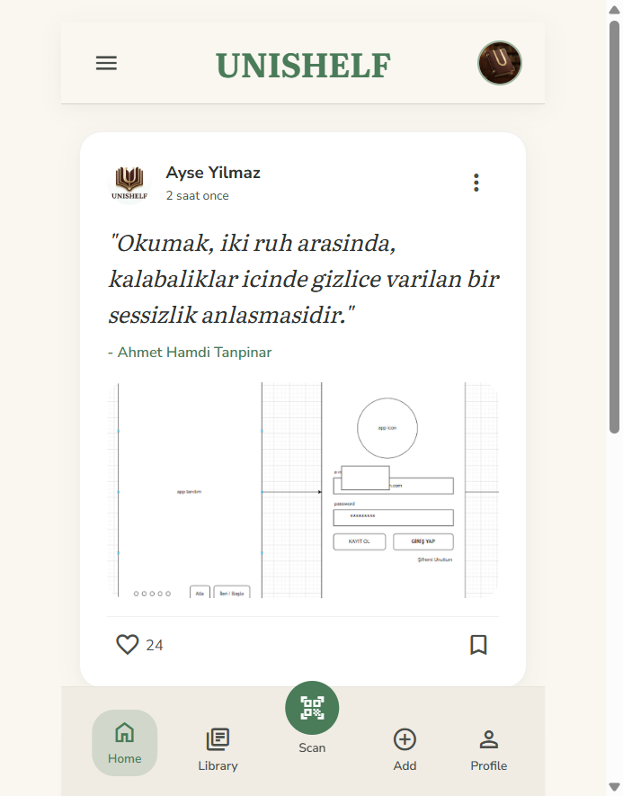

### Library
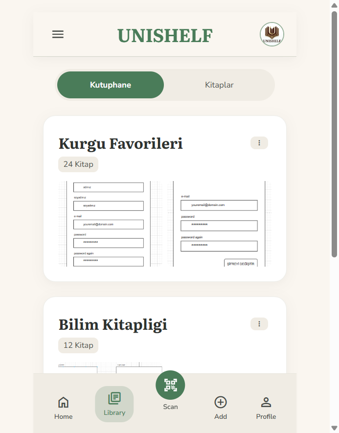

#### Library - Kutuphane (Raf listesi)
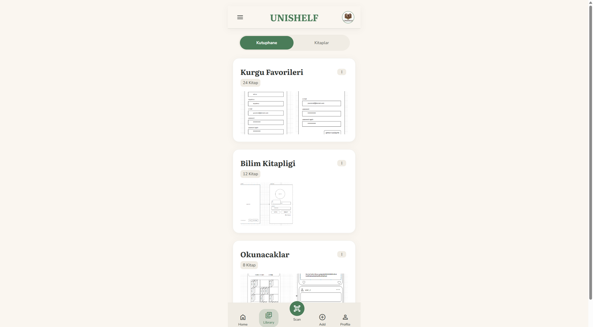

#### Library - Kitaplar
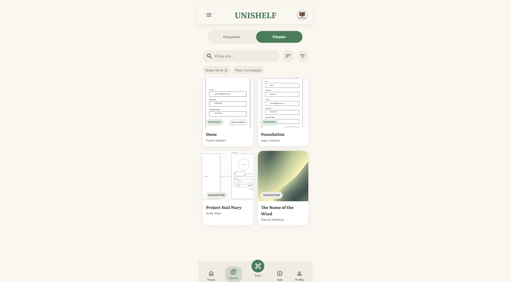

#### Library - Raf detayi
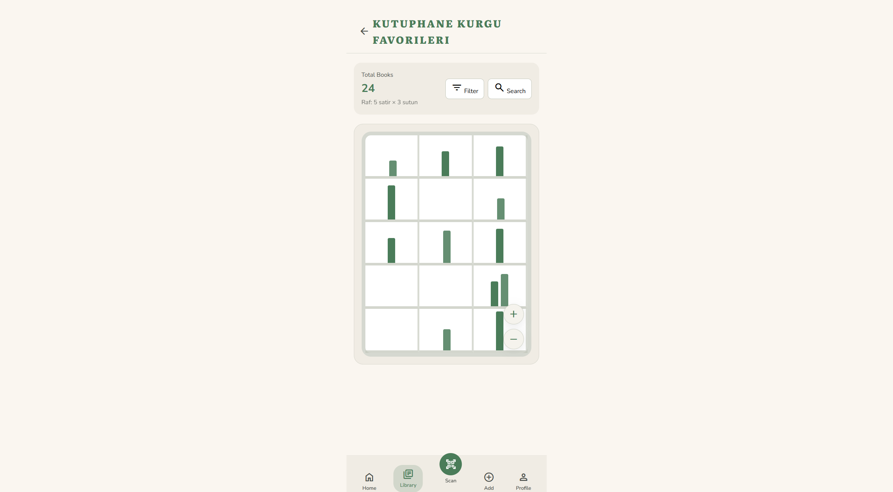

### Scan
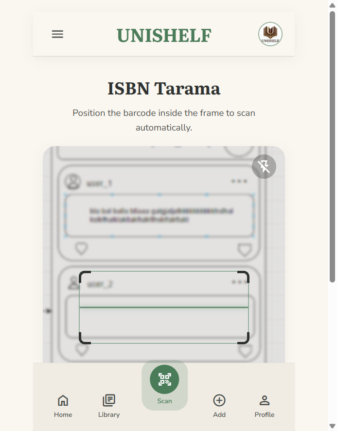

### Add
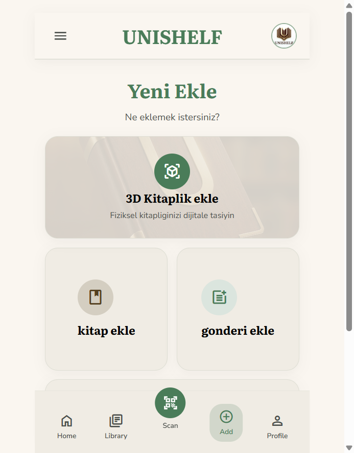

#### Add - Menu
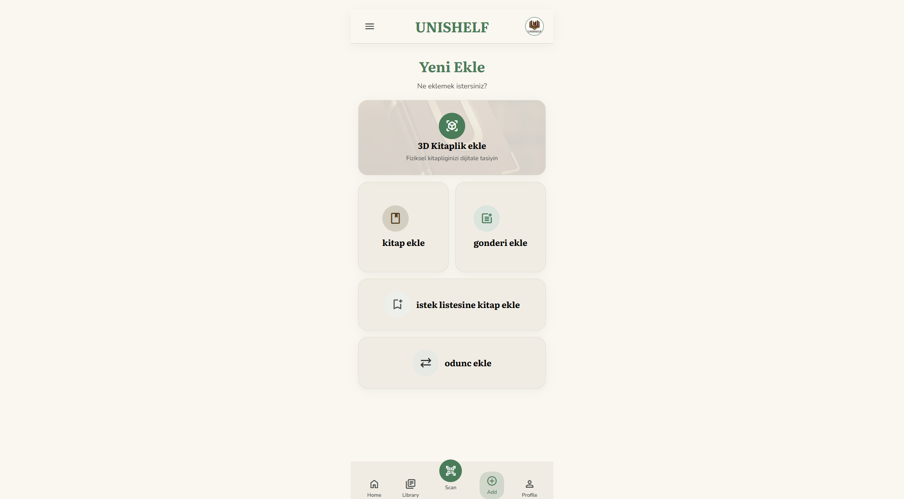

#### Add - 3D Kitaplik Ekle
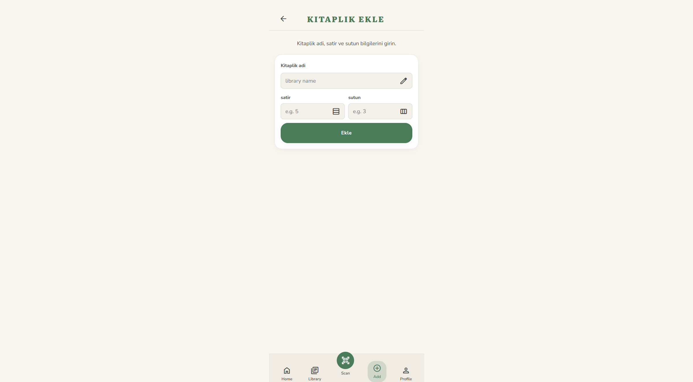

#### Add - Kitap Ekle
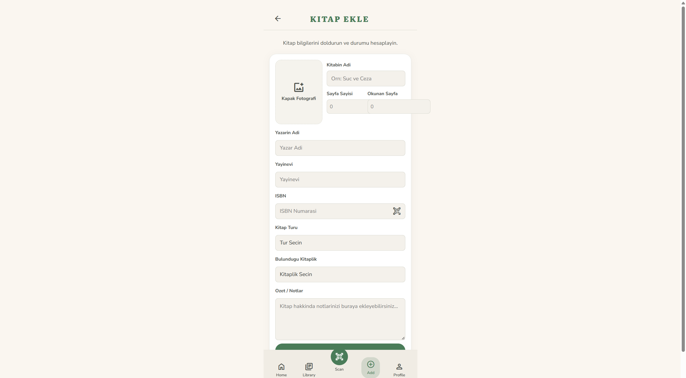

#### Add - Gonderi Ekle
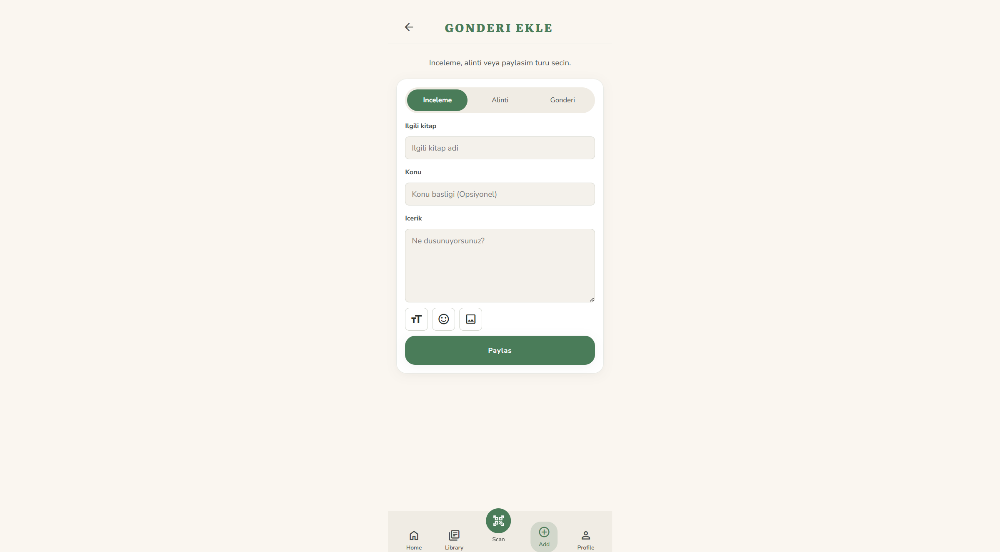

#### Add - Istek Listesine Ekle
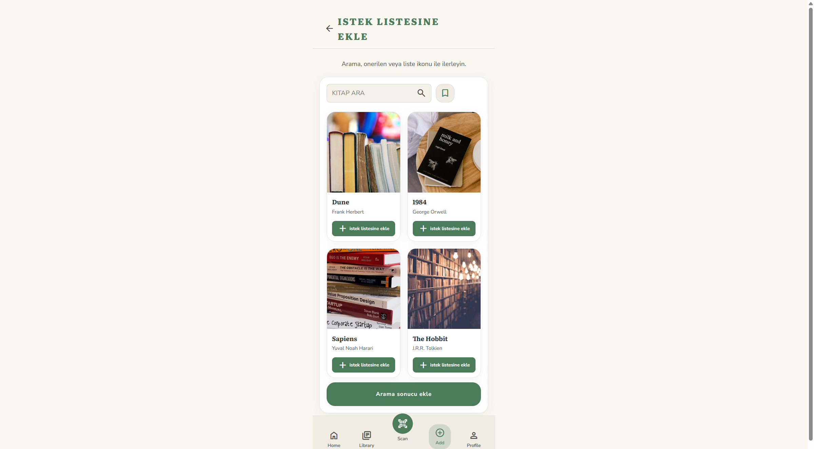

#### Add - Odunc Ekle
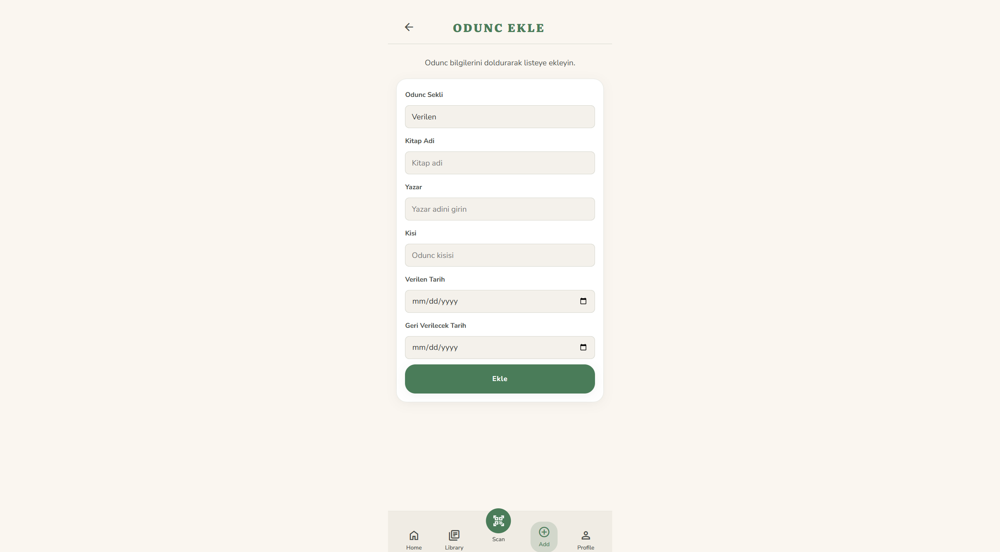

### Profile
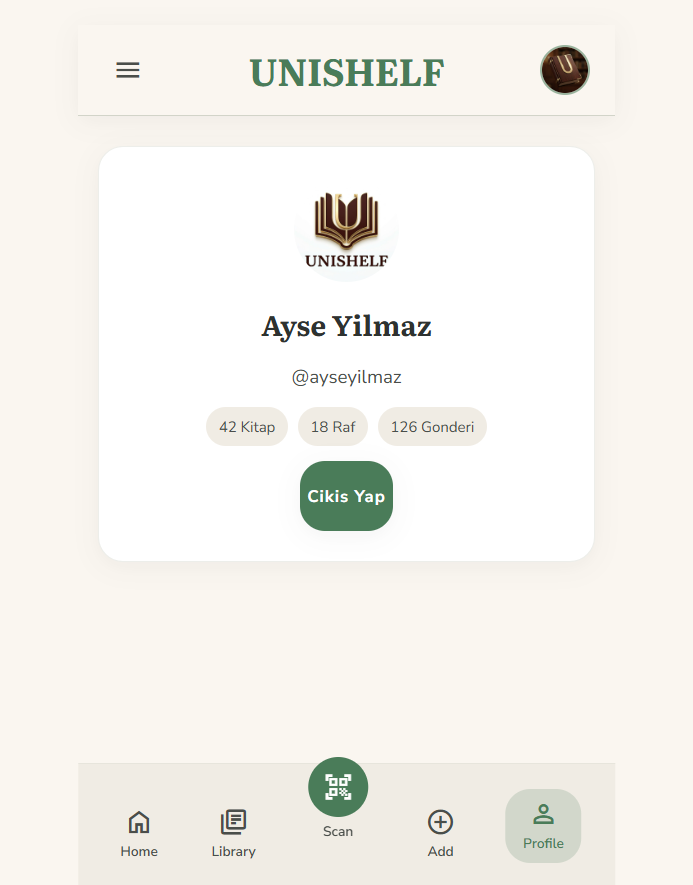
